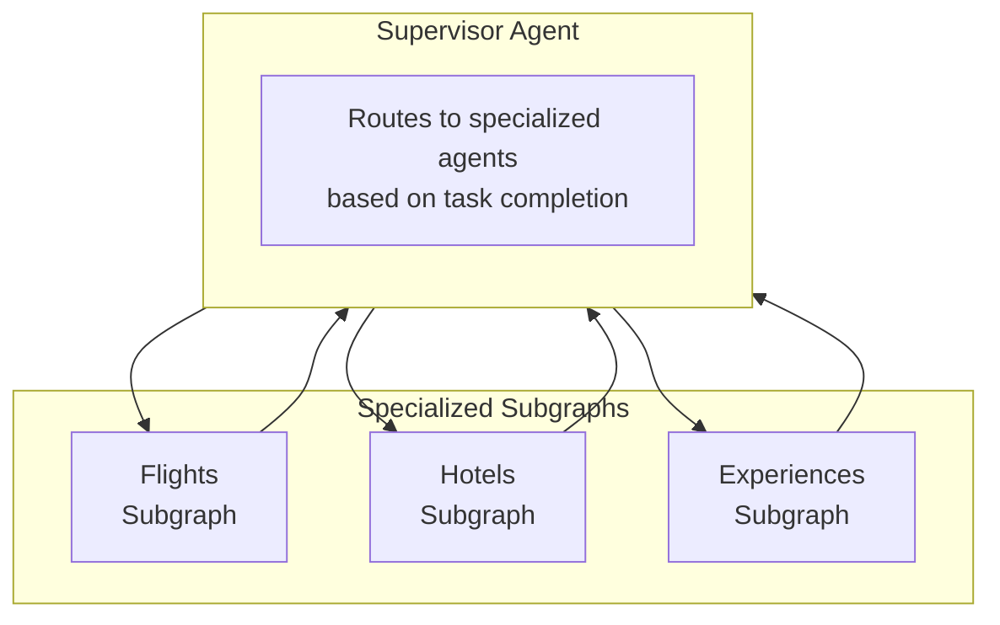
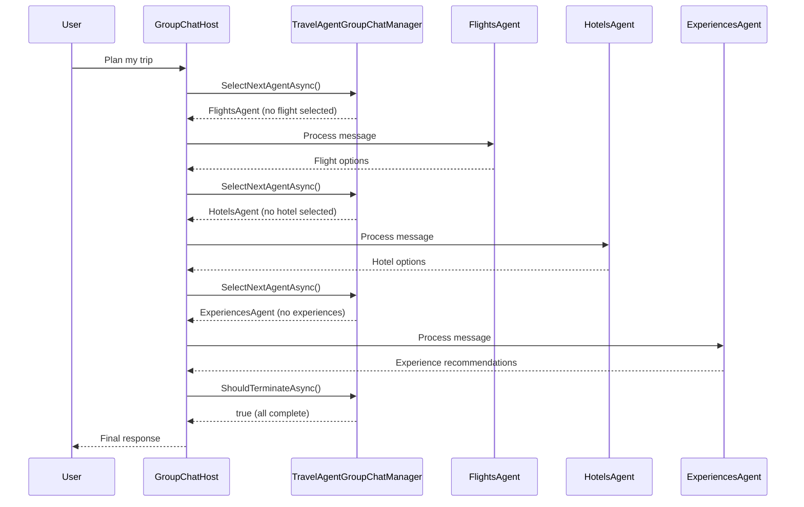
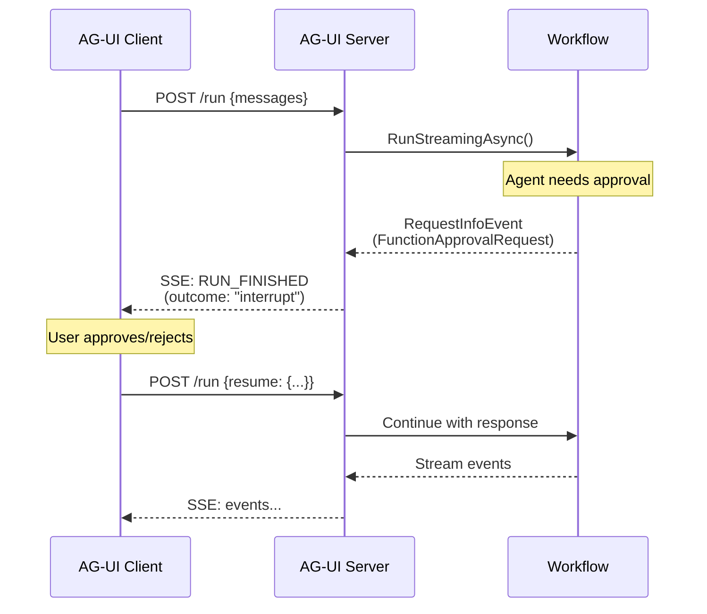

# AG-UI Subgraphs Implementation using Microsoft Agent Framework Workflows

## Overview

This specification document maps the LangGraph subgraphs implementation from the AG-UI protocol repository to Microsoft Agent Framework Workflows concepts, and proposes an implementation plan for the AG-UI Dojo Server sample.

## Reference Implementation: LangGraph Travel Agent Supervisor

The LangGraph reference implementation ([ag-ui-protocol/ag-ui](https://github.com/ag-ui-protocol/ag-ui/blob/main/integrations/langgraph/python/examples/agents/subgraphs/agent.py)) demonstrates a multi-agent architecture with:

### Architecture Overview



### Key LangGraph Concepts

| LangGraph Concept | Description |
|-------------------|-------------|
| **StateGraph** | Defines the workflow graph with nodes and edges |
| **MessagesState** | Shared state schema that includes messages |
| **Subgraph** | A compiled graph that can be used as a node |
| **Command** | Routing instruction to control flow (`goto=END` or `goto=agent_name`) |
| **interrupt()** | Pauses execution for human-in-the-loop input |
| **Supervisor Pattern** | Central coordinator that decides which agent to invoke |

### LangGraph State Schema

```python
class TravelAgentState(MessagesState):
    origin: str = ""
    destination: str = ""
    flights: List[Flight] = None
    hotels: List[Hotel] = None
    experiences: List[Experience] = None
    itinerary: Annotated[dict, merge_itinerary] = None  # Custom reducer
    tools: List[Any] = None
    next_agent: Optional[str] = None
```

## Microsoft Agent Framework Workflows Concept Mapping

### Direct Concept Mappings

| LangGraph Concept | Agent Framework Equivalent | Notes |
|-------------------|---------------------------|-------|
| `StateGraph` | `WorkflowBuilder` | Fluent API for building workflow graphs |
| `CompiledStateGraph` | `Workflow` | The immutable compiled workflow |
| `Node` | `Executor` | Processing unit that handles messages |
| `Edge` | `Edge` / `AddEdge()` | Connection between executors |
| `Subgraph` | `workflow.BindAsExecutor()` | Nested `Workflow` bound as executor |
| `MessagesState` | `ChatMessage[]` via `AgentWorkflowBuilder` | Messages flow through agents automatically |
| `Command(goto=...)` | `GroupChatManager.SelectNextAgentAsync()` | Manager decides routing |
| `interrupt()` | `FunctionApprovalRequestContent` / `RequestInfoExecutor` | Human-in-the-loop pattern |
| `Supervisor` | `GroupChatWorkflowBuilder` with custom `GroupChatManager` | Central coordinator pattern |

### Key Finding: Using Agents Without Custom Executors

**Important**: The Agent Framework provides `AgentWorkflowBuilder` which allows using agents directly without creating custom executors:

| Method | Pattern | Use Case |
|--------|---------|----------|
| `AgentWorkflowBuilder.BuildSequential(agents)` | Sequential | Pipeline processing |
| `AgentWorkflowBuilder.BuildConcurrent(agents)` | Concurrent | Parallel execution |
| `AgentWorkflowBuilder.CreateHandoffBuilderWith(agent)` | Handoff | Dynamic agent-to-agent control |
| `AgentWorkflowBuilder.CreateGroupChatBuilderWith(managerFactory)` | Group Chat | Supervisor/orchestrator pattern |

For the LangGraph supervisor pattern, **Group Chat orchestration** is the best fit because:
- Uses a central manager (supervisor) that decides which agent speaks next
- Supports custom termination conditions
- Maintains shared conversation context across all agents
- No need to create custom executors - agents are used directly

### Orchestration Pattern Mapping

| LangGraph Pattern | Agent Framework Equivalent | Best Fit |
|-------------------|---------------------------|----------|
| Supervisor + subgraphs | Group Chat orchestration | ✓ Uses star topology with central manager |
| Dynamic routing (Command) | Handoff orchestration | ✓ Mesh topology with dynamic handoffs |
| Parallel execution | Concurrent orchestration | ✓ Fan-out to multiple agents |
| Sequential pipeline | Sequential orchestration | ✓ Linear execute-and-forward |

## Proposed Implementation: TravelAgentWorkflow

### State Model

```csharp
// State classes for the travel agent workflow

/// <summary>
/// Represents a flight option.
/// </summary>
public sealed class Flight
{
    public string Airline { get; set; } = string.Empty;
    public string Departure { get; set; } = string.Empty;
    public string Arrival { get; set; } = string.Empty;
    public string Price { get; set; } = string.Empty;
    public string Duration { get; set; } = string.Empty;
}

/// <summary>
/// Represents a hotel option.
/// </summary>
public sealed class Hotel
{
    public string Name { get; set; } = string.Empty;
    public string Location { get; set; } = string.Empty;
    public string PricePerNight { get; set; } = string.Empty;
    public string Rating { get; set; } = string.Empty;
}

/// <summary>
/// Represents an experience (restaurant or activity).
/// </summary>
public sealed class Experience
{
    public string Name { get; set; } = string.Empty;
    public string Type { get; set; } = string.Empty;  // "restaurant" or "activity"
    public string Description { get; set; } = string.Empty;
    public string Location { get; set; } = string.Empty;
}

/// <summary>
/// Represents the selected items in the travel itinerary.
/// </summary>
public sealed class TravelItinerary
{
    public Flight? SelectedFlight { get; set; }
    public Hotel? SelectedHotel { get; set; }
    public List<Experience>? SelectedExperiences { get; set; }
}

/// <summary>
/// The shared state for the travel agent workflow.
/// </summary>
public sealed class TravelAgentState
{
    public string Origin { get; set; } = "Amsterdam";
    public string Destination { get; set; } = "San Francisco";
    public List<Flight>? Flights { get; set; }
    public List<Hotel>? Hotels { get; set; }
    public List<Experience>? Experiences { get; set; }
    public TravelItinerary Itinerary { get; set; } = new();
}
```

### Custom GroupChatManager (Supervisor)

The supervisor is implemented as a custom `GroupChatManager` that routes to agents based on task completion:

```csharp
/// <summary>
/// Custom GroupChatManager that implements the supervisor pattern.
/// Routes to specialized agents based on what tasks are incomplete.
/// </summary>
internal sealed class TravelAgentGroupChatManager : GroupChatManager
{
    private readonly IReadOnlyList<AIAgent> _agents;
    private TravelAgentState _state = new();

    public TravelAgentGroupChatManager(IReadOnlyList<AIAgent> agents)
    {
        _agents = agents;
    }

    protected override ValueTask<AIAgent> SelectNextAgentAsync(
        IReadOnlyList<ChatMessage> history,
        CancellationToken cancellationToken = default)
    {
        // Check what's completed
        bool hasFlights = _state.Itinerary.SelectedFlight is not null;
        bool hasHotels = _state.Itinerary.SelectedHotel is not null;
        bool hasExperiences = _state.Experiences is not null;

        // Select next agent based on what's missing (priority order)
        AIAgent? nextAgent = null;

        if (!hasFlights)
        {
            nextAgent = _agents.FirstOrDefault(a => a.Name == "FlightsAgent");
        }
        else if (!hasHotels)
        {
            nextAgent = _agents.FirstOrDefault(a => a.Name == "HotelsAgent");
        }
        else if (!hasExperiences)
        {
            nextAgent = _agents.FirstOrDefault(a => a.Name == "ExperiencesAgent");
        }

        return new ValueTask<AIAgent>(nextAgent ?? _agents[0]);
    }

    protected override ValueTask<bool> ShouldTerminateAsync(
        IReadOnlyList<ChatMessage> history,
        CancellationToken cancellationToken = default)
    {
        if (IterationCount >= MaximumIterationCount)
            return new ValueTask<bool>(true);

        bool hasFlights = _state.Itinerary.SelectedFlight is not null;
        bool hasHotels = _state.Itinerary.SelectedHotel is not null;
        bool hasExperiences = _state.Experiences is not null;

        return new ValueTask<bool>(hasFlights && hasHotels && hasExperiences);
    }
}
```

### Workflow Factory

The workflow is built using `AgentWorkflowBuilder.CreateGroupChatBuilderWith()` - **no custom executors needed**:

```csharp
/// <summary>
/// Factory for creating the Travel Agent workflow using Group Chat orchestration.
/// </summary>
public static class TravelAgentWorkflowFactory
{
    public static Workflow Create(IChatClient chatClient)
    {
        // Create specialized agents - used directly, no custom executors needed!
        ChatClientAgent flightsAgent = new(
            chatClient,
            "You are the Flights Agent. Present flight options and recommend the best one.",
            "FlightsAgent",
            "Finds and recommends flight options");

        ChatClientAgent hotelsAgent = new(
            chatClient,
            "You are the Hotels Agent. Present hotel options and recommend the best one.",
            "HotelsAgent",
            "Finds and recommends hotel accommodations");

        ChatClientAgent experiencesAgent = new(
            chatClient,
            "You are the Experiences Agent. Recommend restaurants and activities.",
            "ExperiencesAgent",
            "Recommends restaurants and activities");

        // Build Group Chat workflow with custom manager (supervisor pattern)
        return AgentWorkflowBuilder
            .CreateGroupChatBuilderWith(agents => new TravelAgentGroupChatManager(agents)
            {
                MaximumIterationCount = 10
            })
            .AddParticipants(flightsAgent, hotelsAgent, experiencesAgent)
            .Build();
    }
}
```

### Integration with AG-UI Hosting

To integrate with the existing AG-UI hosting infrastructure:

```csharp
// In Program.cs
app.MapAGUI("/subgraphs", CreateTravelAgentWorkflow(chatClient).AsAgent(), sessionStore);
```

The `Workflow.AsAgent()` method converts the workflow to an `AIAgent` interface, which is what `MapAGUI` expects.

### Workflow Execution Flow



### Interrupt/Resume Flow (Human-in-the-Loop)



### State Synchronization

AG-UI state events map to workflow state:

| AG-UI Event | Workflow Equivalent |
|-------------|---------------------|
| `StateSnapshotEvent` | `IWorkflowContext.GetStateAsync()` serialized |
| `StateDeltaEvent` | JSON Patch from state changes |
| `MessagesSnapshotEvent` | Conversation messages from session |

## Implementation Status

### Completed (POC Validated - Compiles Successfully)

The following files have been created in `samples/AGUIClientServer/AGUIDojoServer/Subgraphs/`:

| File | Purpose |
|------|---------|  
| `TravelAgentModels.cs` | State model classes (`Flight`, `Hotel`, `Experience`, `TravelItinerary`, `TravelAgentState`) |
| `TravelData.cs` | Static demo data (same as LangGraph example) |
| `TravelAgentGroupChatManager.cs` | Custom supervisor that routes based on task completion |
| `TravelAgentWorkflowFactory.cs` | Workflow builder using `AgentWorkflowBuilder.CreateGroupChatBuilderWith()` |

### Next Steps

1. **Wire up to AG-UI endpoint** in `Program.cs`
   ```csharp
   app.MapAGUI("/subgraphs", TravelAgentWorkflowFactory.Create(chatClient).AsAgent());
   ```

2. **Add state tracking** - Connect manager state to AG-UI state events

3. **Test with AG-UI Dojo client** - Verify end-to-end flow

4. **Add interrupt support** - For flight/hotel selection confirmation

## Key Differences from LangGraph

| Aspect | LangGraph | Agent Framework |
|--------|-----------|-----------------|
| State Management | Built into graph state | Via custom `GroupChatManager` or `IWorkflowContext` |
| Routing | `Command(goto=...)` | `GroupChatManager.SelectNextAgentAsync()` |
| Interrupts | `interrupt()` function | `FunctionApprovalRequestContent` via tool approval |
| Subgraphs | `StateGraph.compile()` as node | `workflow.BindAsExecutor()` |
| Execution Model | Event streaming | Pregel-style supersteps |
| Agent Usage | Via graph nodes | Direct via `AgentWorkflowBuilder` (no custom executors) |

## Open Questions

1. **State Reducer Pattern**: LangGraph uses annotated reducers like `Annotated[dict, merge_itinerary]`. Should we support similar patterns in workflow state?

2. **Manager State Synchronization**: How should the `GroupChatManager` state sync with AG-UI `StateSnapshotEvent`?

3. **AG-UI Step Events**: Should workflow supersteps emit `StepStartedEvent`/`StepFinishedEvent`?

## References

- [AG-UI Protocol Documentation](https://docs.ag-ui.com/)
- [LangGraph Subgraphs Example](https://github.com/ag-ui-protocol/ag-ui/tree/main/integrations/langgraph/python/examples/agents/subgraphs)
- [Microsoft Agent Framework Workflows](https://learn.microsoft.com/en-us/agent-framework/user-guide/workflows/overview)
- [Orchestration Patterns](https://learn.microsoft.com/en-us/agent-framework/user-guide/workflows/orchestrations/overview)
- [Group Chat Sample](samples/GettingStarted/Workflows/Agents/GroupChatToolApproval)
